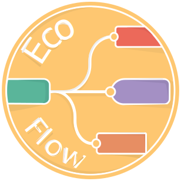

# EcoFlowJS 

[](https://opensource.org/licenses/MIT)

EcoFlowJS is a powerful and user-friendly framework for creating, developing, and managing RESTful APIs within minutes. It's a flow-based, low-code drag-and-drop visual programming system that requires minimal code writing.

## 🚀 Features

- 🧩 **Visual API Builder**: Create RESTful APIs by dragging and dropping nodes
- 🗄️ **Multiple Database Connections**: Support for various databases
- 📊 **Database Management**: Easy monitoring and manipulation of database records
- 🔑 **User Management**: Role and permission-based user system
- 🌐 **Environment Variables**: Live updates during runtime
- ⚙️ **Flexible Configuration**: Manage API router, CORS, directories, and more
- 📦 **Package Management**: Install and remove packages as needed
- 🛠️ **Custom Modules**: Create and install custom modules for extended functionality

## 🖼️ Screenshots

<details>
<summary>Click to expand</summary>

### API Builder


### Database Management


### Environment Variables


### Configuration


</details>

## 🛠️ Tech Stack

- [Commander](https://github.com/tj/commander.js/): CLI interface
- [Koa](https://koajs.com/): Web framework
- [Passport](http://www.passportjs.org/): Authentication middleware
- [Lodash](https://lodash.com/): Utility library
- [Knex](http://knexjs.org/): SQL query builder
- [Mongoose](https://mongoosejs.com/): MongoDB object modeling
- [query-registry](https://www.npmjs.com/package/query-registry): npm registry API wrapper
- [Socket.io](https://socket.io/): Real-time communication
- [React](https://reactjs.org/): Frontend library
- [React Flow](https://reactflow.dev/): Interactive diagram builder

## 📖 Documentation

For complete documentation, visit [https://docs.eco-flow.in/](https://docs.eco-flow.in/)

## ✅ Prerequisites

> Before installing EcoFlowJS, the following requirements must be installed on your computer:
>
> - [Node.js](https://nodejs.org/en): Only [Active LTS or Maintenance LTS versions](https://nodejs.org/en/about/previous-releases) are supported (currently v18 and v20). Odd-number releases of Node, known as "current" versions of Node.js, are not supported (e.g. v19, v21).
> - npm (v6 and above)
> - Python (3.6.0 and above)
>
> **On Unix**
>
> - `make`
> - A proper C/C++ compiler toolchain, like [GCC](https://gcc.gnu.org/)
>
> **On macOS**
>
> - `Xcode Command Line Tools` which will install `clang`, `clang++`, and `make`.
>
>   - Install the `Xcode Command Line Tools` standalone by running `xcode-select --install`.
>
>     **-- OR --**
>
>   - Alternatively, if you already have the [full Xcode installed](https://developer.apple.com/xcode/download/), you can install the Command Line Tools under the menu `Xcode -> Open Developer Tool -> More Developer Tools...`.
>
> **On Windows**
>
> Install tools with [Chocolatey](https://chocolatey.org/):
>
> ```bash
>    choco install visualstudio2022-workload-vctools -y
> ```
>
> Or install and configure Visual Studio tools manually:
>
> - Install Visual C++ Build Environment: For Visual Studio 2019 or later, use the `Desktop development with C++` workload from [Visual Studio Community](https://visualstudio.microsoft.com/thank-you-downloading-visual-studio/?sku=Community). For a version older than Visual Studio 2019, install [Visual Studio Build Tools](https://visualstudio.microsoft.com/thank-you-downloading-visual-studio/?sku=BuildTools) with the `Visual C++ build tools` option.

## 🚀 Getting Started

```bash
# Installation
sudo npm install -g @ecoflow/cli@latest

# Start the application
ecoflow
```

> **NOTE** : On Windows, omit `sudo`.

For more detailed instructions, refer to our [Getting Started Guide](https://docs.eco-flow.in/user-docs/getting-started/welcome).

## 🗺️ Future Roadmap

- [ ] Implement admin CLI commands
- [ ] Enhance normal CLI commands
- [ ] Integrate Socket.io as request and emitter nodes
- [ ] Implement file manipulation operations
- [ ] Add more official packages
- [ ] Create an official registry on top of npm registry

## 🤝 Contributing

Contributions, issues, and feature requests are welcome! Feel free to check [issues page](https://github.com/EcoFlowJS/eco-flow/issues).

## 📞 Support

For support, email teams.ecoflow@gmail.com or join our community:

- [Discord](https://discord.gg/arvbpxDUHb)
- [Slack](https://join.slack.com/t/ecoflowjs/shared_invite/zt-2jpm9657q-dmugTuLg_udxo9jTtnwZjA)

## 📝 License

This project is [MIT](https://github.com/EcoFlowJS/eco-flow/blob/main/LICENSE) licensed.

## 🙏 Acknowledgements

- Inspired by [NODE-RED](https://nodered.org/) and [Scratch 3.0](https://scratch.mit.edu/)
- Special thanks to [Subhojit Karmakar](https://dev.to/rocketscience) for guidance

---

Made with ❤️ by [EcoFlowJS Team](https://github.com/EcoFlowJS)
