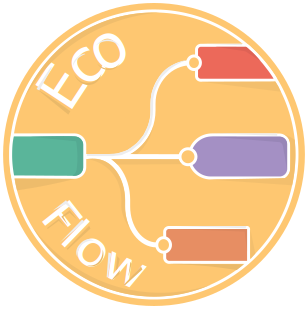

# EcoFlowJS 

[](https://github.com/EcoFlowJS/eco-flow/blob/main/LICENSE)

EcoFlowJS enables low-code programming for deploying RESTful APIs effortlessly.

## 🚀 Quick Start

Follow this guide to install and run EcoFlowJS in minutes.

###  Prerequisites

Ensure you have a [supported version of Node.js](https://nodejs.org/en/download) installed.

### ⬇️ Installation

To install EcoFlowJS globally using npm:

```bash
sudo npm install -g @ecoflow/cli@latest
```

> **Note:** On Windows, omit `sudo`.

##  Running EcoFlowJS

After installation, start EcoFlowJS with the `ecoflow` command:

```bash
ecoflow
```

### Terminal Output

```plaintext
[ 29-5-2024 22:05:26 ] : [ EcoFlow ] : Starting up EcoFlow services
[ 29-5-2024 22:05:27 ] : [ EcoFlow ] | [ info ] : ====================================
[ 29-5-2024 22:05:27 ] : [ EcoFlow ] | [ info ] : Starting Application....
[ 29-5-2024 22:05:27 ] : [ EcoFlow ] | [ info ] : Adding Database Connection _sysDB
[ 29-5-2024 22:05:27 ] : [ EcoFlow ] | [ info ] : Database Connection Added named : _sysDB
[ 29-5-2024 22:05:27 ] : [ EcoFlow ] | [ info ] : System Database Connection Successfully
[ 29-5-2024 22:05:27 ] : [ EcoFlow ] | [ info ] : Installing default modules using ecoModule
[ 29-5-2024 22:05:27 ] : [ EcoFlow ] | [ info ] : Initializing the existing flow...
[ 29-5-2024 22:05:27 ] : [ EcoFlow ] | [ info ] : Server listening on http://127.0.0.1:4000
[ 29-5-2024 22:05:27 ] : [ EcoFlow ] | [ info ] : ====================================
[ 29-5-2024 22:05:27 ] : [ EcoFlow ] | [ info ] : Server Ready to use!!!
```

Access the EcoFlowJS editor at [http://127.0.0.1:4000](http://127.0.0.1:4000).

## 📃 Developer Guide

To run the latest code from the repository, follow these steps:

### 1️⃣ Clone the Repository

```bash
git clone https://github.com/EcoFlowJS/eco-flow.git
```

Or clone recursively with submodules:

```bash
git clone --recurse-submodules https://github.com/EcoFlowJS/eco-flow.git
```

### 2️⃣ Navigate to the Project Directory

```bash
cd eco-flow
```

### 3️⃣ Install Dependencies

```bash
npm install --legacy-peer-deps
```

### 4️⃣ Build the Project

```bash
npm run build
```

### 5️⃣ Start the Server

Start the backend:

```bash
npm run dev:backend
```

Start the frontend:

```bash
npm run frontend
```

> **Note:** Ensure you cloned with submodules for these commands to work.

##  Command-line Usage

EcoFlowJS can be started using the `ecoflow` command with various arguments:

```bash
ecoflow [-?] [-h] [--configName config.json] [--userDir DIR] [--port PORT]
```

### Basic Commands

| Option          | Type      | Description                                         | Default     |
| :-------------- | :-------- | :-------------------------------------------------- | :---------- |
| `-h, --host`    | `string`  | Optional. Sets the TCP address of the server.       | `127.0.0.1` |
| `-p, --port`    | `string`  | Optional. Sets the TCP port the runtime listens on. | `4000`      |
| `--auth`        | `boolean` | Optional. Enable authentication mode.               | `false`     |
| `-D, --dev`     | `boolean` | Optional. Enable development mode.                  | `false`     |
| `-u, --user`    | `string`  | Optional. Sets the user directory.                  | `$HOME`     |
| `-v, --verbose` | `boolean` | Optional. Enable verbose output.                    | `false`     |
| `-V, --version` | `boolean` | Optional. Display the runtime version.              |             |
| `-?, --help`    | `boolean` | Optional. Display the available commands.           |             |

### Admin Commands

Currently under development.

##  Upgrading EcoFlowJS

To upgrade to the latest version:

```bash
sudo npm install -g @ecoflow/cli@latest
```

> **Note:** On Windows, omit `sudo`.

## 📜 Documentation

Project documentation is available [here](https://eco-flow.in/docs/category/documentation)

##  Contributing

Please review our [contributing guide](https://github.com/EcoFlowJS/eco-flow/blob/main/CONTRIBUTING.md) before submitting a pull request.

This project follows the [Contributor Covenant 2](https://www.contributor-covenant.org/version/2/1/code_of_conduct/). Report any violations to teams.ecoflow@gmail.com.

## 🤝 Support

For support, email teams.ecoflow@gmail.com or join us on:

- [Discord](https://discord.gg/arvbpxDUHb)
- [Slack channel](https://join.slack.com/t/ecoflowjs/shared_invite/zt-2jpm9657q-dmugTuLg_udxo9jTtnwZjA).

##  Feedback

We welcome your feedback at teams.ecoflow@gmail.com.

## 🪪 License

Copyright (c) 2023 EcoFLowJS

This project is licensed under the [MIT License](https://github.com/EcoFlowJS/eco-flow/blob/main/LICENSE).

## 🙍‍♂️ Authors

_The Authors of this software are listed below:_

- **EcoFlowJS**

  [](https://github.com/EcoFlowJS)
  &nbsp;&nbsp;
  [](https://discord.gg/KAGjRHbnqW)

- **Romel Sikdar**

  [](https://github.com/RomelSikdar)
  &nbsp;&nbsp;
  [](https://www.facebook.com/Figh7err)
  &nbsp;&nbsp;
  [](https://www.instagram.com/aditya.sikdar)
